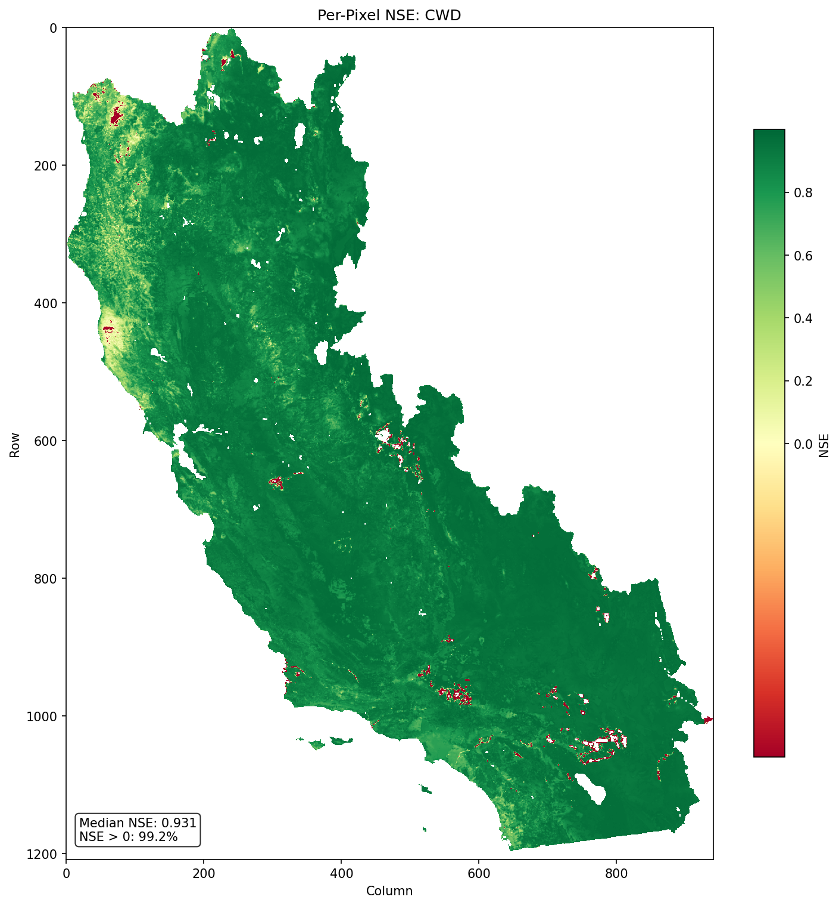
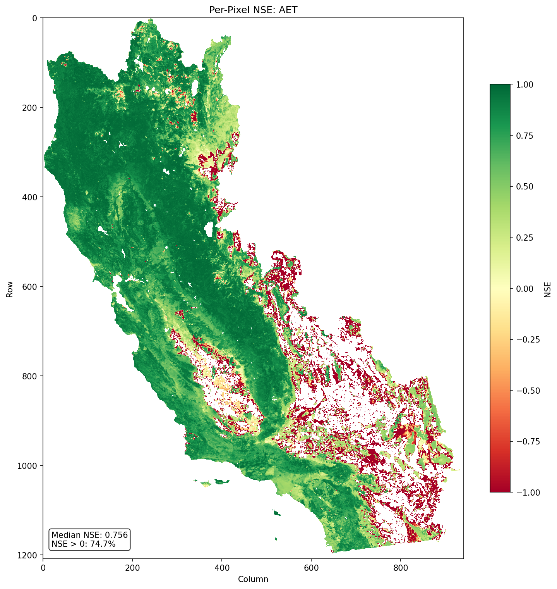

# BCM Emulator

A deep learning emulator for the Basin Characterization Model (BCM), a hydrological simulation model for California. The emulator uses a temporal convolutional network (TCN) to predict key water balance variables — replacing expensive computational simulations with fast neural network inference.

## Predicted Variables

- **PET** — Potential Evapotranspiration
- **AET** — Actual Evapotranspiration
- **PCK** — Snowpack
- **CWD** — Climatic Water Deficit (algebraic: PET − AET)

## How Well Does It Work? (v17-polaris-awc)

The current best model, **v17-polaris-awc**, reproduces the expensive BCM simulation almost exactly — but in seconds instead of hours. Here's what that means in plain terms.

### The scorecard

We grade the emulator with a standard hydrology "skill score" called **NSE** (Nash–Sutcliffe Efficiency). It's easy to read:

- **NSE = 1.0** → a perfect match to the real BCM model.
- **NSE = 0.0** → no better than just guessing the long-term average.
- **NSE below 0** → worse than guessing.

In practice, anything above **0.8 is considered very good** and above **0.9 is excellent**.

| Variable | What it is | NSE (skill) | Typical error |
|----------|-----------|:-----------:|:-------------:|
| **CWD** — Climatic Water Deficit | How "thirsty" the landscape is (drought stress) | **0.93** ✅ | ±16 mm |
| **PCK** — Snowpack | Water stored as mountain snow | **0.95** ✅ | ±12 mm |
| **PET** — Potential Evapotranspiration | Atmospheric "demand" for water | **0.88** ✅ | ±21 mm |
| **AET** — Actual Evapotranspiration | Water actually used by plants/soil | **0.85** ✅ | ±12 mm |

**The bottom line:** the emulator's most important output — **CWD, the drought-stress indicator** — matches the original model with 93% skill, and the predictions hold up even on data the model never saw during training (a 5-year holdout covering the 2020–2024 megadrought scored CWD NSE = 0.92).

### Figure 1 — Where the model is accurate (drought stress / CWD)



This map grades the emulator at **every single 1 km pixel** in California for CWD. **Green = excellent agreement** with the real BCM model; red would mean trouble. The map is almost entirely green: **99.2% of all pixels score better than "just guessing,"** and the median pixel scores 0.93. In short, the emulator is reliable essentially everywhere — across mountains, valleys, coast, and desert alike.

### Figure 2 — Where it's hardest (water use / AET)



AET — the water plants and soils actually use — is the toughest variable to predict, and this map shows why. Most of the state is still green (good), but **red speckles appear in the deserts and dry valleys of the southeast**. In those arid spots, actual water use is tiny and erratic from month to month, so even small absolute errors look large on this score. This is a known limitation, not a failure: statewide AET still scores a solid 0.85, and the errors are concentrated in the driest, least-vegetated areas where the values barely change anyway.

## Project Structure

```
bcm_emulator/
├── config.yaml              # Master configuration
├── prepare_data.py          # Data download & preprocessing
├── train.py                 # Model training
├── evaluate.py              # Evaluation & inference
├── src/
│   ├── data/                # Datasets, splits, downloaders
│   │   ├── dataset.py       # BCMPixelDataset, ElevationStratifiedSampler
│   │   ├── splits.py        # Train/test temporal splits
│   │   ├── preprocessing.py # Zarr store construction
│   │   ├── download_prism.py
│   │   ├── download_sciencebase.py
│   │   ├── download_daymet.py
│   │   └── download_srad.py
│   ├── models/              # Neural network architecture
│   │   ├── bcm_model.py     # Main BCMEmulator model
│   │   ├── backbone.py      # 5-level dilated TCN backbone
│   │   ├── layers.py        # CausalConv1d, TemporalBlock
│   │   └── heads.py         # PET/PCK/AET output heads
│   ├── training/            # Training loop & losses
│   │   ├── trainer.py       # BCMTrainer
│   │   ├── losses.py        # Weighted multi-task MSE
│   │   └── teacher_forcing.py
│   ├── evaluation/          # Metrics & visualization
│   │   ├── metrics.py       # NSE, KGE, RMSE, percent bias
│   │   └── spatial_maps.py  # Per-pixel NSE maps (GeoTIFF)
│   └── utils/
│       ├── config.py        # YAML config loader
│       ├── io_helpers.py    # Raster I/O, BCM file parsing
│       └── topo_solar.py    # Topographic solar radiation
```

## Setup

```bash
pip install -r requirements.txt
```

## Usage

### 1. Prepare Data

Download climate inputs (PRISM, ScienceBase, TerraClimate) and build a normalized Zarr store:

```bash
python prepare_data.py --config config.yaml --steps all
```

Individual steps can be run separately: `sciencebase`, `pck_gap`, `prism_daily`, `srad`, `topo_solar`, `zarr`.

### 2. Train

```bash
python train.py --config config.yaml
```

Training uses:
- AdamW optimizer with cosine annealing + linear warmup
- Teacher forcing curriculum (ground-truth → autoregressive over 100 epochs)
- Elevation-stratified sampling across the California 1 km grid
- Mixed precision (AMP) with gradient clipping

Checkpoints are saved to `checkpoints/`.

### 3. Evaluate

```bash
python evaluate.py --config config.yaml --checkpoint checkpoints/best_model.pt
```

Outputs:
- `outputs/metrics.json` — NSE, KGE, RMSE, percent bias per variable
- `outputs/acf_diagnostics.json` — residual autocorrelation (lags 1–12)
- `outputs/spatial_maps/nse_*.tif` — per-pixel NSE maps

## Model Architecture

- **Input**: 13 channels (9 dynamic climate + 4 static terrain features)
- **Backbone**: 5-level dilated TCN (channels: 64 → 128 → 128 → 256 → 256, kernel size 3, receptive field 125 months)
- **Heads**: PET and PCK use softplus activation (≥ 0); AET uses a sigmoid stress factor multiplied by PET to guarantee AET ≤ PET
- **CWD**: Computed algebraically as PET − AET (no learned parameters)

## Data Sources

| Source | Variables | Resolution |
|--------|-----------|------------|
| ScienceBase (BCMv8) | Tmin, Tmax, Precipitation, AET, CWD, PCK | 270 m → 1 km |
| PRISM | Daily precipitation → wet days, intensity | 4 km → 1 km |
| TerraClimate | Monthly solar radiation (srad) | ~4.7 km → 1 km |
| DEM-derived | Elevation, slope, aspect, topographic solar | 1 km |

## Configuration

All settings are in `config.yaml`, including:
- File paths for data sources and outputs
- Grid specification (EPSG:3310, 1209 × 941 pixels at 1 km)
- Train/test temporal splits (1980–2019 / 2019–2020)
- Model hyperparameters, loss weights, and training schedule

## License

See LICENSE file for details.
